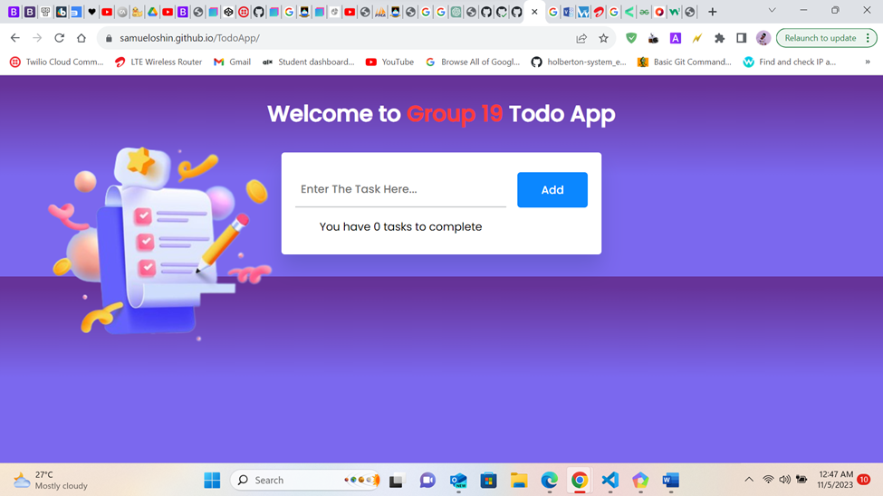
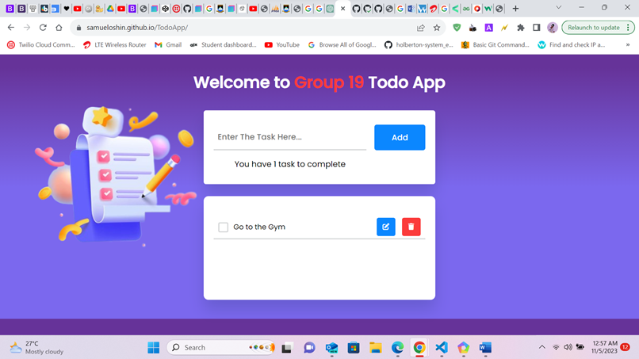
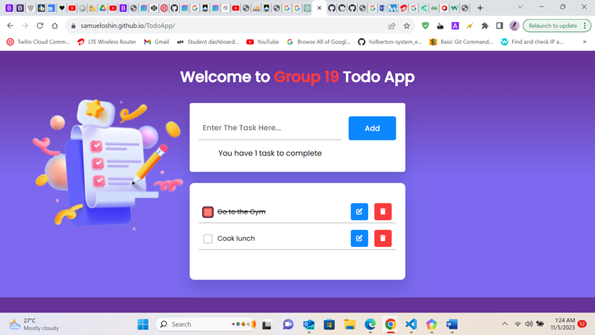

# TodoApp

## Title: Todo App Documentation
Introduction:
Welcome to the official documentation for the Todo app. This documentation is designed to help you understand and effectively use our Todo app, whether you're a user looking to manage your tasks or a developer interested in contributing to the project.
About the Todo App: The Todo app is a simple task management tool that allows you to create, edit, and delete tasks, helping you stay organized and productive. Whether you're managing your personal to-do list or collaborating with a team, our app makes it easy to keep track of your tasks.
Purpose of this Documentation: In this documentation, we'll provide detailed instructions on how to set up, use, and customize the Todo app. We'll also cover the app's code structure, configuration options, and provide guidance for developers interested in contributing to the project.
Prerequisites: Before you get started with the Todo app, you should have a basic understanding of web development, HTML, CSS, and JavaScript. To contribute to the project, you'll need a GitHub account to submit pull requests and report issues.
Let's dive in and explore the features and capabilities of the Todo app!

## Overview:
Welcome to the Todo app, a powerful and intuitive task management tool designed to help you stay organized and productive. Whether you're managing your daily to-do list or collaborating with a team, our app offers a range of features to simplify task management.
Key Features:
•	Create tasks: Add new tasks with ease and set due dates to stay on track.
•	Edit tasks: Update task names and due dates as your priorities change.
•	Delete tasks: Remove completed or unnecessary tasks to keep your list clean.
•	Task completion: Mark tasks as completed and watch them get crossed off your list.
•	Task persistence: Your tasks are saved locally using Local Storage, so they'll be there when you return to the app.
Designed for Everyone:
Our Todo app is designed for individuals, small teams, and anyone seeking a straightforward yet powerful task management solution. Whether you're a student managing assignments or a professional juggling work tasks, our app is tailored to meet your needs.
Built with Web Technologies:
The Todo app is built using web technologies, including HTML, CSS, and JavaScript. It's accessible through web browsers on various platforms, making it a versatile solution for task management.
Getting Started:
Getting started with the Todo app is easy. Follow these steps to set up and run the app on your system:
System Requirements:
Before you proceed, make sure your system meets the following requirements:
•	A modern web browser (Google Chrome, Mozilla Firefox, Microsoft Edge, or Safari).
•	An internet connection if you're using the live version hosted on GitHub Pages.
•	Basic knowledge of web development (HTML, CSS, and JavaScript).
Installation:
If you're using the live version hosted on GitHub Pages, no installation is required. You can access the app directly in your web browser by visiting Todo App.
Running Locally:
If you prefer to run the app locally, you can follow these steps:
1.	Clone the repository to your local machine using Git. Open your terminal and run the following command:
git clone https://github.com/SamuelOshin/TodoApp.git 
2.	Navigate to the project directory:
cd TodoApp 
3.	Open the index.html file in your preferred web browser. You can also use a development server if you have one set up.
Dependencies:
The Todo app does not have any external dependencies. You only need a web browser to run the app, and it uses Local Storage for data persistence.
Usage:
The Todo app offers a straightforward and user-friendly interface for managing your tasks. Follow these instructions to make the most of its features:
Creating a Task:
1.	On the main page, you'll see the "Enter The Task Here..." input field.
2.	Type the name of your task into the input field.
3.	Press the "Add" button to add the task to your list.
4.	Your task will now appear in the list of tasks.
Editing a Task:
1.	To edit a task, click the "Edit" button (pencil icon) next to the task you want to modify.
2.	The task name will be copied to the input field for editing.
3.	Make the desired changes to the task name.
4.	Click the "Add" button to save your changes.
5.	The task will be updated with the new name.
Completing a Task:
1.	To mark a task as completed, click the checkbox next to the task.
2.	The task name will be crossed out, indicating it's completed.
Deleting a Task:
1.	To delete a task, click the "Delete" button (trash can icon) next to the task.
2.	The task will be removed from your list.
Task Persistence:
Your tasks are automatically saved in Local Storage, so they'll be available the next time you visit the app. There's no need to create an account or log in.
Task Count:
The "You have x task(s) to complete" message at the top of the page reflects the number of tasks you have in your list. This count is updated in real-time as you add, complete, or delete tasks.
Stay Organized:
Use the Todo app to organize your daily tasks, manage work assignments, or keep track of any list of activities. It's a versatile tool designed to make task management simple and efficient.

## Screenshots:
Here are some annotated screenshots to help you get familiar with the Todo app's interface and features.

Screenshot 1: Main Page
 
Figure 1: The main page displays your list of tasks. You can add, edit, and delete tasks using the input field and buttons.

Screenshot 2:  Creating a Task

 
Figure 2: To create a new task, enter the task name in the input field and click the "Add" button. Click the "Edit" button (pencil icon) to modify a task's name. Make changes in the input field and save by clicking "Add.
Screenshot 3: Completing a Task

 
Figure 4: Mark a task as completed by clicking the checkbox next to the task. The task name will be crossed out.
To delete a task, click the "Delete" button (trash can icon) next to the task. The task will be removed from your list
## Code Structure

The code for the Todo app is organized into several components and follows a modular structure to enhance readability and maintainability. Here's an overview of the main components and their responsibilities:

### `index.html`

- The HTML file serves as the entry point for the app.
- It defines the structure of the web page, including the header, input field, task list, and error message.
- Key HTML elements include:
  - `<input>` for entering new tasks.
  - `<button>` for adding tasks.
  - `
` for displaying the task list.
  - `
` for showing error messages.
  - `<h1>` for the app's title.
  - `` for the left image.

### `style.css`

- The CSS file contains styles for the app's visual presentation.
- It defines styles for various elements, including the input field, task list, buttons, and text.
- Key CSS classes include:
  - `.task` for styling individual tasks.
  - `.delete` and `.edit` for styling delete and edit buttons.
  - `#pending-task` for the pending task count.
  - `h1` for the app's title.
  - `.left-image` for the left image's styling.

### `script.js`

- The JavaScript file contains the app's logic and functionality.
- It handles tasks such as adding, editing, deleting, and completing tasks, as well as managing local storage.
- Key functions and components include:
  - `addTask()` for adding new tasks.
  - `displayTasks()` for rendering tasks from local storage.
  - `editTasks` and `deleteTasks` for handling edit and delete functionality.
  - `updateStorage()` for managing local storage.
  - `updateTaskCount()` for updating the task count.

The code is organized to maintain separation of concerns and facilitate future enhancements and maintenance. It follows best practices for code structure, readability, and maintainability.

## Code Structure

The code for the Todo app is organized into several components and follows a modular structure to enhance readability and maintainability. Here's an overview of the main components and their responsibilities:

### `index.html`

- The HTML file serves as the entry point for the app.
- It defines the structure of the web page, including the header, input field, task list, and error message.
- Key HTML elements include:
  - `<input>` for entering new tasks.
  - `<button>` for adding tasks.
  - `
` for displaying the task list.
  - `
` for showing error messages.
  - `<h1>` for the app's title.
  - `` for the left image.

### `style.css`

- The CSS file contains styles for the app's visual presentation.
- It defines styles for various elements, including the input field, task list, buttons, and text.
- Key CSS classes include:
  - `.task` for styling individual tasks.
  - `.delete` and `.edit` for styling delete and edit buttons.
  - `#pending-task` for the pending task count.
  - `h1` for the app's title.
  - `.left-image` for the left image's styling.

### `script.js`

- The JavaScript file contains the app's logic and functionality.
- It handles tasks such as adding, editing, deleting, and completing tasks, as well as managing local storage.
- Key functions and components include:
  - `addTask()` for adding new tasks.
  - `displayTasks()` for rendering tasks from local storage.
  - `editTasks` and `deleteTasks` for handling edit and delete functionality.
  - `updateStorage()` for managing local storage.
  - `updateTaskCount()` for updating the task count.

The code is organized to maintain separation of concerns and facilitate future enhancements and maintenance. It follows best practices for code structure, readability, and maintainability.
